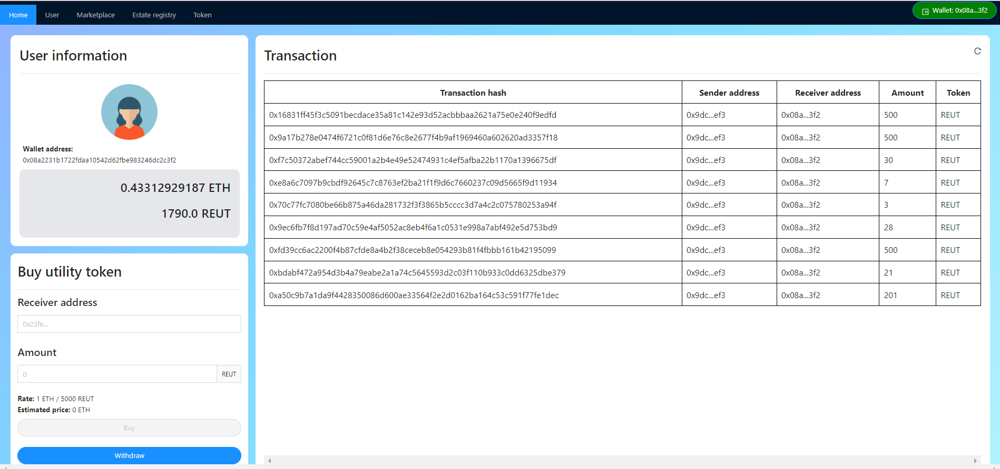
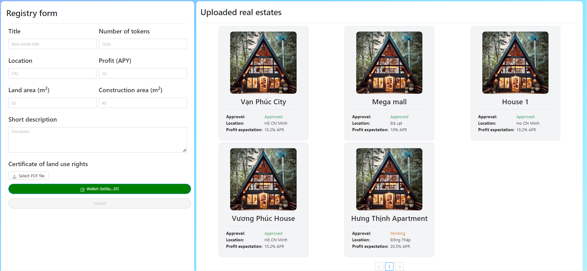
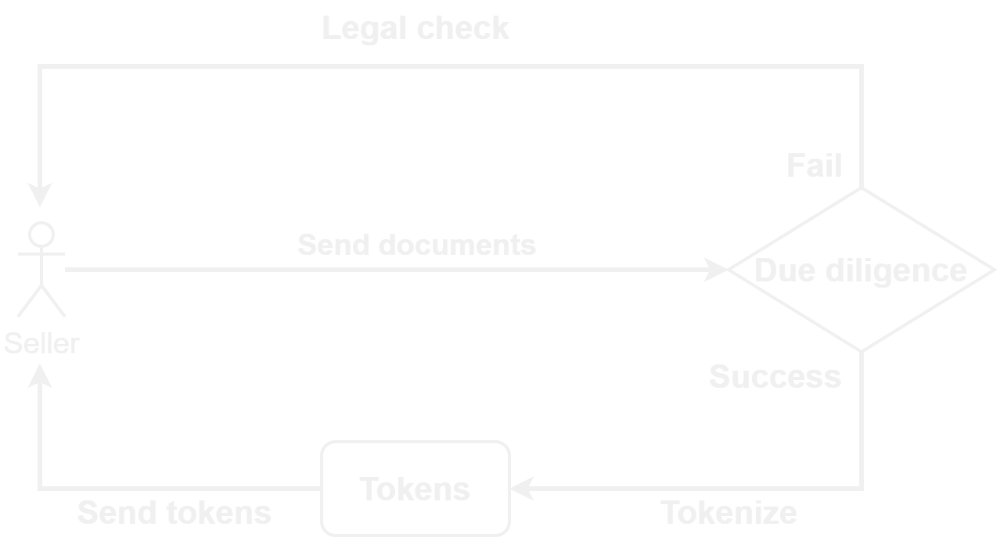
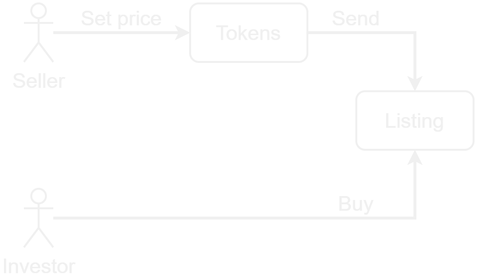
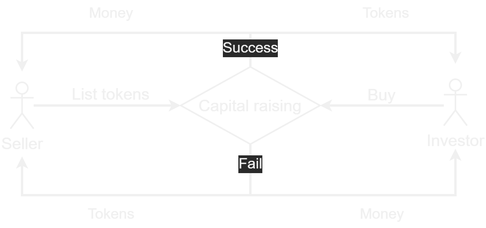
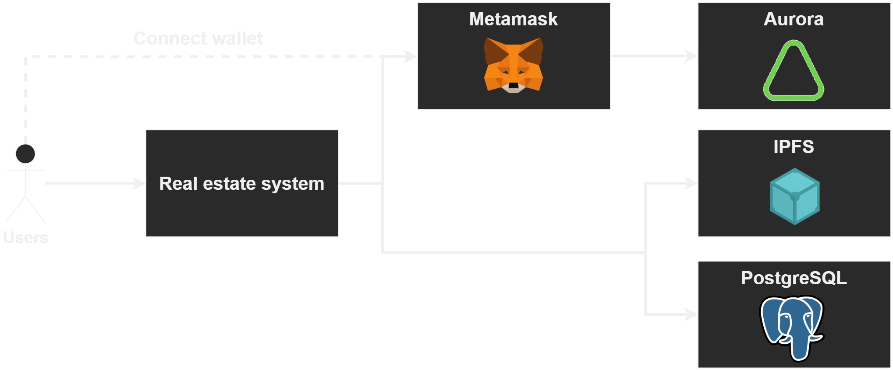

# MYPT Real Estate Digitalization

## Introduction

Real estate is asset which contains a huge value compared to others. However, the process to buy and sell these thing are very complicated and time-consuming. Because of that, we propose a system which can tokenize the asset that makes them:

- Have a big number of owners
- Can be bought with small capital
- Instantly trading

Moreover, because the information of asset must be secure, we use blockchain technologies in this system.

## Gallery

    

    <b>User information</b>

    

    <b>Registry real estate</b>

## How to use?

The system have 2 main features:

- Tokenize real estate
- Marketplace

Furthermore, to do the fund raising, we also have utility token which will not mention at below.

### Tokenize your real estate

To tokenize the real estate, the seller first upload their certificate of land use rights. After that, the team will do the due diligence. If they are accepted, the token will send back to seller and our company will keep the certificate.

  

### Marketplace - Listing

After tokenizing, the seller can bring their token to sell with any price they want. Anyone can buy these tokens on the marketplace.

  

### Marketplace - Capital raising

If they don't want to listing their tokens, they can do the capital raising (crowdfunding) instead. This is similar to how a crowdfunding happen. If the sale was success (all the token were bought), the money will be sent back to seller and investors will receive tokens. In contrast, the tokens and money will be refunded if it fail.

  

### Marketplace - Bidding
:construction: This feature is still under developing

### Marketplace - Swap
:construction: This feature is still under developing
## Architecture

The system uses:

- Metamask: a wallet to sign transactions
- Aurora engine: runs on NEAR Protocol Blockchain
- IPFS: stores important and unchangable files, such as certificate of land use rights
- Postgres database: stores less important and changable files, such as unverified real estate

  

## Contribution

This project is owned by the MYPT team including:

- [phuc16102001](https://github.com/phuc16102001)
- [congthanhquangphu](https://github.com/congthanhquangphu)

**Do not copy at any cost!**