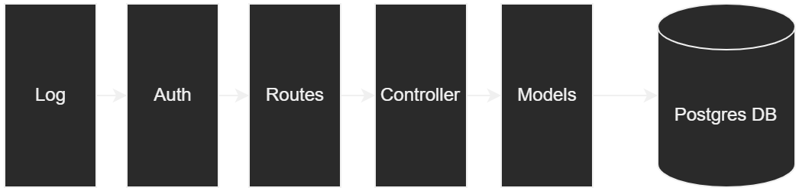

# MYPT Backend

## How to use

Firstly, you need to install the [PostgreSQL](https://www.postgresql.org/) database and run the `database/create-table.psql` to create the database.

Before running the source code, you need API token to interact with your IPFS server. In this project, we use [Web3Storage IPFS](https://web3.storage/). Create a `.env` file in the folder which contains this file:

```bash
WEB3STORAGE_TOKEN=<YOUR_API_TOKEN>
DATABASE_PASSWORD=<YOUR_DATABASE_PASSWORD>
```

## Code exploration

The backend system uses the middlewares architecture which shown as below:

- Log: used to log all the inputs
- Auth: used to verify authorization with JWT
- Routes: used to route the endpoint to the correct controller
- Controller: used to handle business logic
- Models: used to communicate with database and query

<p align="center">
  
</p>

<p align="center">
    <b>Architecture of backend</b>
</p>
