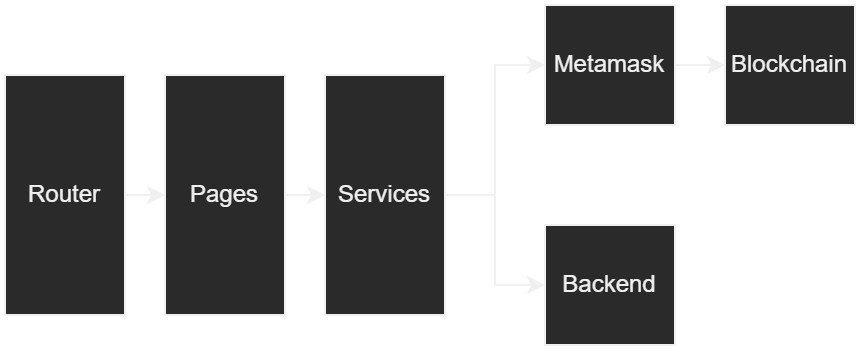

# MYPT Frontend
## How to use

To scan all the transactions of the Aurora Engine, we use the [Aurora Scan](https://aurorascan.dev/) which provie an API to do that. To use it, you need an API Token for you account. Create a `.env` file in the folder which contains this file:

```bash
REACT_APP_AURORASCAN_TOKEN = <YOUR_AURORASCAN_TOKEN>
```

## Code exploration

The frontend and backend are built as a PERN stack application. The architecture of this is very simple:
- Routes: used to route the endpoint
- Pages: used to show components
- Services: used to communicate with blockchain (through metamask) and backend

<p align="center">
  
</p>

<p align="center">
    <b>Architecture of frontend</b>
</p>
